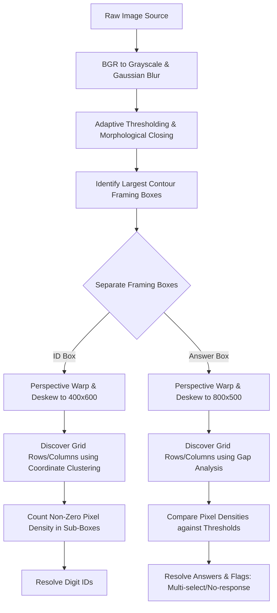

# Smart OMR 📝🔍

A premium, high-performance, cross-platform Flutter application for scanning, grading, and analyzing Optical Mark Recognition (OMR) sheets in real time. Powered by native OpenCV image processing and a hybrid offline-first database synchronization architecture.

---

## 🌟 Key Features

### 1. Advanced OMR Scanning Engine
* **Native OpenCV Integration**: Utilizes `opencv_dart` for low-latency, highly accurate image processing directly on the device.
* **Autonomous Grid Discovery**: Automatically detects sheet anchors, performs perspective warp correction, and extracts bubbles dynamically without needing hardcoded pixel coordinates.
* **Smart Bubble Detection**: Employs adaptive thresholding and morphological operations to identify choices, handles single/multi-select answers, and accurately filters out printer outlines or empty answers.
* **Dual Capture Modes**: Supports real-time camera scanning (live viewfinder) as well as file uploads (gallery/file picker).

### 2. Dynamic Sheet Generator
* **Auto-Generated PDFs**: Instantly creates and prints printable A4 PDF bubble sheets configured dynamically for any number of questions, choices, or student ID digits.
* **Marker-Aided Alignment**: Embedded with outer orientation blocks and four sub-markers at corners to assist the camera pipeline in automatic document alignment and deskewing.

### 3. Class Analytics & Reporting
* **Professional PDF Reports**: Generates in-depth class performance summaries including average scores, pass/fail metrics, and grade distribution histograms.
* **Item Analysis**: Computes per-question accuracy and classifies questions automatically as **Easy**, **Medium**, or **Hard** depending on student performance.
* **Excel Exporting**: Quick export capabilities to format grading data into spreadsheets for LMS ingestion.

### 4. Hybrid Offline-First Sync Architecture
* **Dual Databases**: SQLite (`sqflite`) for instant, responsive offline capability and Cloud Firestore for seamless cross-device synchronization.
* **Smart Auto-Sync**: Background worker auto-detects internet connection changes, pushes local unsynced edits, pulls cloud records, and cleanly reconciles deleted collections.
* **Robust Offline Queuing**: Firestore writes queue offline gracefully during bad or absent connectivity.

### 5. Multi-User & Secure Workspaces
* **Firebase Authentication**: Support for secure Google Sign-In and email login.
* **Isolated Tenant Spaces**: Full data separation where all students, exams, and results are cryptographically tied to unique user IDs.

### 6. Fully Localized (RTL & LTR)
* Built-in support for **English** (LTR) and **Arabic** (RTL) locales, automatically adapting UI directions, layouts, and input parameters.

---

## 🛠️ Tech Stack & Dependencies

* **Framework**: [Flutter](https://flutter.dev) (Dart SDK `>=3.3.0 <4.0.0`)
* **Computer Vision**: `opencv_dart` (Native OpenCV wrapper)
* **Local Storage**: `sqflite` (SQLite for Flutter), `path_provider`
* **Cloud Infrastructure**: Firebase Core, Firebase Auth, Google Sign-In, Cloud Firestore
* **Media & I/O**: `camera`, `image_picker`, `file_picker`
* **File Generators & Printers**: `pdf`, `printing`, `excel`, `open_file`
* **State Management**: `provider` (with proxy providers for authenticated scopes)

---

## 📁 Repository Structure

```text
lib/
├── db/
│   └── database_helper.dart      # Local SQLite database helper, schemas, and migrations (v4)
├── generated/                    # Automatically generated localization code
├── l10n/
│   ├── app_ar.arb                # Arabic translations
│   └── intl_en.arb               # English translations (Template)
├── locale_provider.dart          # Manages locale switching (English / Arabic)
├── main.dart                     # App entry point, material theme configuration, and provider tree
├── models/
│   ├── exam.dart                 # Exam configuration details model
│   ├── question.dart             # Specific question keys, point weights, and choice models
│   ├── result.dart               # Student test results and choice matrices
│   └── student.dart              # Student identification details
├── providers/
│   ├── auth_provider.dart        # Authentication management (Firebase / Google)
│   ├── student_provider.dart     # List updates, filtering, and group exports
│   └── sync_provider.dart        # SQLite to Cloud Firestore sync daemon & autoSync routines
├── screens/
│   ├── create_account_screen.dart# Authentication sign-up page
│   ├── create_exam_screen.dart   # Exam creator and bubble sheet previewer
│   ├── edit_exam_screen.dart     # Update keys/weights of established exams
│   ├── exam_results_screen.dart  # Detailed scoreboard per exam
│   ├── home_dashboard_screen.dart# Landing page with stats dashboard, sync updates, and quick navigation
│   ├── live_scan_screen.dart     # Real-time camera scanner with active viewfinder guide
│   ├── main_navigation_screen.dart# Navigation drawer/bar controller
│   ├── omr_scan_screen.dart      # Document scanner workflow controller (gallery selection / validation)
│   ├── profile_screen.dart       # User details and account management
│   ├── results_overview_screen.dart# Overall grades and charts per student
│   ├── student_group_screen.dart # Group-based lists of students
│   ├── student_list_screen.dart  # Comprehensive directory of students
│   ├── student_result_screen.dart# Detail page showing exact scanned bubble sheets with score
│   └── welcome_screen.dart       # Interactive onboarding and login screen
└── utils/
    ├── omr_pdf_print.dart        # PDF document builder for physical OMR bubble sheets
    ├── omr_pipeline.dart         # Core OpenCV image analysis and lattice solver
    └── report_generator.dart     # PDF statistics analyzer & reporter
```

---

## ⚙️ Core OMR Scanning Workflow

The scan engine follows a modular computer vision pipeline:



1. **Preprocessing**: The input image is converted to grayscale, blurred, and passed to an adaptive thresholding algorithm. A morphological closing operation cleans shadows and folds on frame boundaries.
2. **Structural Search**: The algorithm scans for the thick bounding boxes wrapping the Student ID and Answer sections.
3. **Perspective Warp**: Bounding boxes are corrected using a 4-point perspective transformation, producing straight-on, fixed-size matrices.
4. **Autonomous Grid Extraction**: Coordinates of circular marks (seeds) are clustered to build dynamic row and column lattices, adapting on the fly to slight printing variations.
5. **Mark Detection**: Sub-rectangles around each lattice point are checked for non-zero pixel density. The system flags marked, unmarked, or double-marked answers.

---

## 🚀 Getting Started

### Prerequisites

* [Flutter SDK](https://docs.flutter.dev/get-started/install) (version `>=3.3.0`)
* [Dart SDK](https://dart.dev/get-started)
* Android Studio / Xcode configured for mobile compilation
* Firebase Console access

### Installation & Run

1. **Clone the repository**:
   ```bash
   git clone https://github.com/yourusername/omr1.git
   cd omr1
   ```

2. **Retrieve dependencies**:
   ```bash
   flutter pub get
   ```

3. **Set up Firebase**:
   * Create a project in the Firebase Console.
   * Add Android and iOS apps.
   * Register Google Sign-In in your Firebase Auth options.
   * Download the `google-services.json` (Android) and `GoogleService-Info.plist` (iOS) configuration files and place them in their respective native directories:
     * Android: `android/app/google-services.json`
     * iOS: `ios/Runner/GoogleService-Info.plist`

4. **Verify OpenCV Dependency**:
   Ensure native dependencies are configured correctly. The package `opencv_dart` installs native binaries automatically on target platforms. For custom device setups, refer to the package guidelines.

5. **Run the App**:
   ```bash
   flutter run
   ```

### Running Tests
To run flutter test suites:
```bash
flutter test
```

---

## 📄 License

This project is licensed under the MIT License - see the LICENSE file for details.
